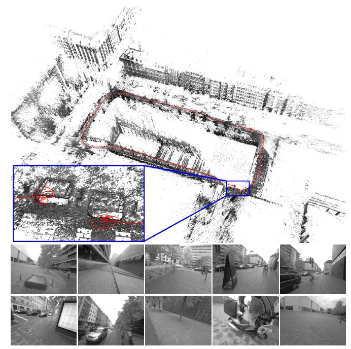
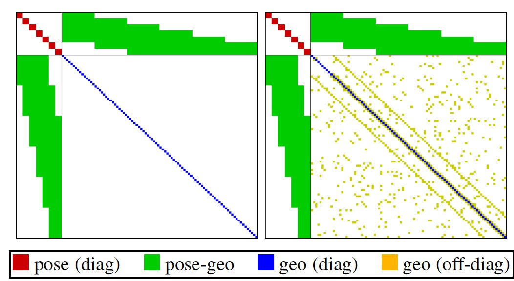
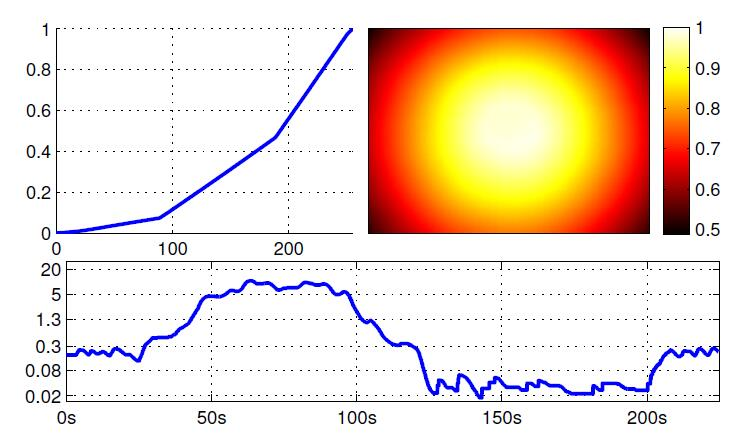
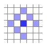
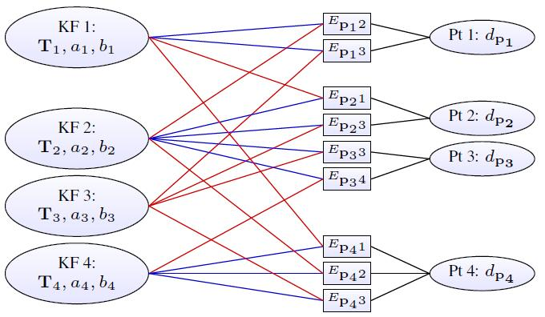

# DSO

# Direct Sparse Odometry：直接稀疏里程计

<!--more-->

**摘要**：我们提出了一个新颖的直接稀疏里程计方法（DSO）。整个系统结合了一个完全直接的概率模型（最小化光度误差），并对所有的模型参数进行优化，包括在参考帧中表示为反深度的几何图形和相机运动。为了达到实时运算，算法去除了直接法添加先验的做法，取而代之的是从整个图像上均匀的采样关键点。因为我们的方法不依赖关键点检测或描述符，所以它可以自然地从所有具有强梯度的图像区域中采样像素，包括边缘或平滑的光度变化区域（大多在白色墙壁）。该模型集成了一个完整的光度校准，包括曝光时间、透镜光晕和非线性响应函数（这些基本上都是相机的参数）。我们在三个数据集，包括几个小时的视频上全面评估了我们的方法。实验表明，在各种现实环境下，该方法在跟踪精度和鲁棒性方面都显著优于最先进的直接和间接方法。

## 1. 引言

&emsp;&emsp;同时定位和建图（SLAM）和视觉里程计（VO）是许多新兴技术的基本组成部分——从自动驾驶汽车和无人机到虚拟现实和增强现实。近年来，SLAM和VO的实时方法取得了重大进展。虽然长期以来该领域由基于特征的（间接）方法主导，但近年来，许多不同的方法越来越受欢迎，即直接和密集方法。

    
     
    
图1. 直接稀疏里程计(DSO)。围绕建筑物循环的1:40分钟视频的3D重建和跟踪轨迹（仅限单目视觉里程计）。左下角插图显示了起点和终点的特写，可视化了轨迹过程中累积的漂移。底行显示一些视频帧。

**直接 vs. 间接**：所有公式的基础是一个概率模型，该模型将噪声测量 Y 作为输入，并计算未知的隐藏模型参数X（3D世界模型和相机动作）的估计量 。通常使用最大似然方法，该方法找到使获得实际测量值的概率最大化的模型参数，即，$\mathbf{X}^{*}:=\operatorname{argmax}_{\mathbf{X}} P(\mathbf{Y} \mid \mathbf{X})$。

&emsp;&emsp;间接方法分两步进行。 首先，对原始传感器测量进行预处理以生成中间表示，解决整体问题的一部分，例如建立对应关系。 其次，计算出的中间值被解释为概率模型中的噪声测量 Y，以估计几何和相机运动。 请注意，第一步通常是通过提取和匹配一组稀疏的关键点来实现的——但是也存在其他选项，例如以密集、正则化的光流的形式建立对应关系。它还可以包括提取和匹配其他几何原语(如线段或曲线段)的参数表示的方法。

&emsp;&emsp;直接方法跳过预处理步骤，直接使用实际传感器值（在特定时间段内从特定方向接收到的光）作为概率模型中的测量值 Y。

&emsp;&emsp;在被动视觉的情况下，因为传感器提供光度测量，直接方法因此优化了光度误差。另一方面，间接方法优化几何误差，因为预先计算的值（点位置或流向量）是几何量。请注意，对于其他传感器模式，如深度相机或激光扫描仪（直接测量几何量），直接公式也可以优化几何误差。

**稠密 vs. 稀疏**：稀疏方法仅使用和重建一组选定的独立点（传统上是角点），而密集方法尝试使用和重建 2D 图像域中的所有像素。中间方法（半密集）避免重建完整的表面，但仍旨在使用和重建（主要连接且约束良好的）子集。

&emsp;&emsp;然而，除了使用的图像区域的范围之外，一个更基本的——也是重要的——区别在于添加了几何先验。在稀疏公式中，没有邻域的概念，并且几何参数（关键点位置）在给定相机姿势和内在函数的情况下是条件独立的。另一方面，密集（或半密集）方法利用所用图像区域的连通性来制定几何先验，通常有利于平滑。事实上，要想仅从被动视觉中观察到稠密的世界模型，就必须要有这样的先验。通常，该先验直接以附加对数似然能量项的形式表示[26,21,22]。

&emsp;&emsp;请注意，密集和稀疏之间的区别并不是直接和间接的同义词——事实上，所有四种组合都存在：

- **稀疏+间接**：这是最广泛使用的形式，从一组关键点匹配来估计三维几何，从而使用几何误差而无需几何先验。例如Jin等人的[12]、monoSLAM[4]、PTAM[16]和ORB-SLAM[20]。

- **稠密+间接**：该形式根据密集的正则化光流场或与其结合来估计 3D 几何形状，将几何误差（与流场的偏差）与几何先验（流场的平滑度）相结合，示例包括[27, 23]。

- **稠密+直接**：该公式采用光度误差以及几何先验来估计密集或半密集几何。 示例包括DTAM[21]、其前身[26]和LSD-SLAM[5]。
- **稠密+直接**：这是本文提出的公式。 它优化了直接在图像上定义的光度误差，而不包含几何先验。虽然我们不知道最近有任何使用该公式的工作，但Jin等人在2003年已经提出了一个稀疏和直接的公式[13]。然而，与他们基于扩展卡尔曼滤波器的工作相比，我们的方法使用非线性优化框架。 探索稀疏和直接结合的动机在下一节中阐述。

### 1.1 动机

本文提出的单目视觉里程计的直接和稀疏公式是出于以下考虑。

&emsp;（1）**直接**：关键点的主要好处之一是它们能够对使用现成的商品相机拍摄的图像中存在的光度和几何失真提供鲁棒性。例如自动曝光变化、非线性响应函数（伽马校正/白平衡）、镜头衰减（渐晕）、去拜耳效应，甚至是滚动快门引起的强烈几何失真。

&emsp;&emsp;同时，对于介绍中提到的所有用例，数以百万计的设备将（和已经）配备摄像头，仅用于为计算机视觉算法提供数据，而不是捕获图像供人类消费。这些相机应该并且将被设计为提供完整的传感器模型，并以最适合处理算法的方式捕获数据：例如，自动曝光和伽马校正不是未知的噪声源，而是提供更好图像数据的功能—— 并且可以将其合并到模型中，使获得的数据更具信息性。由于直接方法将完整的图像形成过程建模到像素强度，因此它极大地受益于更精确的传感器模型。

&emsp;&emsp;直接公式的主要优点之一是，它不需要点本身可以识别，因此允许更精细的几何表示（像素逆深度）。此外，我们可以从所有可用的数据中取样——包括边缘和弱强度变化——生成一个更完整的模型，并在稀疏纹理环境中提供更强的鲁棒性。

    
     
    
图2. 稀疏与密集 Hessian 结构。左：稀疏束平差的 Hessian 结构：由于几何几何块是对角线，因此可以使用 Schur 补集高效求解。右图：几何先验增加了（部分非结构化的）几何-几何相关性——因此得到的系统不仅要大得多，而且也变得更难解决。为简单起见，我们不显示全局相机内在参数。

&emsp;（1）**稀疏**：添加几何先验的主要缺点是在几何参数之间引入了相关性，这使得在统计上一致的实时联合优化不可行（参见图 2）。这就是为什么现有的密集或半密集方法（a）忽略或粗略地近似几何参数（橙色）和/或几何参数和相机姿势（绿色）之间的相关性，以及（b）对密集几何采用不同的优化方法 部分，例如原始对偶公式[26, 21, 22]。

&emsp;&emsp;此外，当今先验的表达复杂性是有限的：虽然它们使 3D 重建更密集、局部更准确且更具视觉吸引力，但我们发现先验会引入偏差，从而减少而不是增加长期、大规模的准确性。 请注意，随着时间的推移，随着从现实世界数据中学习到的更现实、无偏见的先验的引入，这很可能会改变。

### 1.2 贡献与概要

&emsp;&emsp;在本文中，我们提出了一种单目视觉里程计的稀疏直接方法。 据我们所知，它是唯一一种完全直接的方法，可以联合优化所有涉及的模型参数的完全似然性，包括相机姿势、相机内在参数和几何参数（逆深度值）。 这与 SVO[9]等混合方法形成对比，后者恢复为联合模型优化的间接形式。

&emsp;&emsp;优化是在滑动窗口中执行的，在滑动窗口中，旧相机姿势以及离开相机视野的点被边缘化，其方式受[17]的启发。对比已经存在的算法，我们的方法充分利用光度相机校准，包括镜头衰减、伽马校正和已知曝光时间。 这种集成的光度校准进一步提高了准确性和稳健性。

&emsp;&emsp;我们基于CPU的实现在笔记本电脑上实时运行。我们在三个不同的数据集（包括几个小时的视频）上进行了广泛的评估，结果表明，它在鲁棒性和准确性方面都优于其他最先进的方法（直接和间接）。通过减少设置（更少的点和活动关键帧），它甚至以 5 实时速度运行，同时仍然优于最先进的间接方法。 反过来，在高、非实时设置（更多点和活动关键帧）上，它创建的半密集模型与 LSD-SLAM 的密度相似，但更准确。

&emsp;&emsp;本文组织如下：第2节介绍了所提出的直接稀疏模型以及加窗优化方法。具体而言，这包括第2.1节中的几何和光度照相机校准、第2.2节中的模型公式以及第2.3节中的窗口优化。第3节描述了前端：算法中执行数据选择并为高度非凸优化后端提供足够精确的初始化的部分。我们在第4.1节中提供了与其他方法的彻底实验比较。我们还评估了重要参数和新概念的影响，如第4.2节中光度校准的使用。在第4.3节中，我们分析了增加的光度和几何噪声对数据的影响。最后，我们在第5节中提供了一个总结。

 

## 2. 直接稀疏模型

&emsp;&emsp;我们的直接稀疏里程计基于最近帧窗口上光度误差的连续优化，同时考虑到用于图像形成的光度校准模型。与现有的直接方法相比，我们联合优化所有涉及的参数（相机内在参数、相机外在参数和逆深度值），有效地执行窗口稀疏束调整的光度等效。我们保留其他直接方法采用的几何表示，即3D点表示为参考系中的逆深度（因此具有一个自由度）。

**注意.** 在整篇论文中，粗体小写字母 (**x**) 表示向量，粗体大写字母 (**H**) 表示矩阵。 标量将由浅色小写字母 (t) 表示，函数（包括图像）将由浅色大写字母 (I) 表示。相机姿态表示为变换矩阵$\mathbf{T}_{i} \in \mathrm{SE}(3)$，变换一个点从世界帧到相机帧。线性化的姿态增量将表示为李代数$x_i \in \mathfrak{s e}(3)$，这里稍微滥用符号，我们直接写成向量$x_i \in \mathbb{R}^{6}$。我们进一步定义了常用的操作符 ⊞ ：$\mathfrak{s e}(3) \times \mathrm{SE}(3) \rightarrow \mathrm{SE}(3)$使用左乘公式，即：
$$
\boldsymbol{x}_i \text { ⊞ } \mathbf{T}_i:=e^{\widehat{\boldsymbol{x}_i}} \cdot \mathbf{T}_i
$$

### 2.1 校准

&emsp;&emsp;直接方法全面建模图像形成过程。 除了几何相机模型（包括将 3D 点投影到 2D 图像上的功能）之外，考虑光度相机模型也是有益的，该模型包括将传感器上的像素（辐照度）接收到的真实世界能量映射到相应的强度值的功能。请注意，对于间接方法，这没有什么好处，因此被广泛忽略，因为常见的特征提取器和描述符对光度变化是不变的（或高度鲁棒的）。

#### 2.1.1 几何相机校准

&emsp;&emsp;为简单起见，我们为众所周知的针孔相机模型制定了我们的方法——在预处理步骤中去除了径向失真。虽然对于广角相机，这确实会减少视野，但它允许对仅实现有限相机型号选择的方法进行比较。在本文中，我们将投影表示为 $\Pi_{\mathrm{c}}: \mathbb{R}^3 \rightarrow \Omega$ 和反投影 $\Pi_{\mathbf{c}}^{-1}: \Omega \times \mathbb{R} \rightarrow \mathbb{R}^3$，其中 c 表示相机的固有参数（对于针孔模型，它们是焦距和主点）。请注意，类似[2]，我们的方法可以扩展到其他(可逆)相机模型，尽管这确实增加了计算需求。

#### 2.1.2 光度相机校准

&emsp;&emsp;我们使用[8]中使用的图像形成模型，它解释了非线性响应函数 $G: \mathbb{R} \rightarrow[0,255]$，以及镜头衰减（渐晕）$V: \Omega \rightarrow[0,1]$。图3显示了来自 TUM monoVO 数据集的示例校准。 组合模型由下式给出：
$$
I_{i}(\mathrm{x})=G\left(t_{i} V(\mathrm{x}) B_{i}(\mathrm{x})\right){\tag 2}
$$
&emsp;&emsp;其中 $B_i$ 和 $I_i$ 是第 $i$ 帧中的辐照度和观察到的像素强度，$t_i$ 是曝光时间。 该模型是通过光度校正每个视频帧作为第一步来应用的，通过计算:
$$
I_{i}^{\prime}(\mathrm{x}):=t_{i} B_{i}(\mathrm{x})=\frac{G^{-1}\left(I_{i}(\mathrm{x})\right)}{V(\mathrm{x})} {\tag 3}
$$
&emsp;&emsp;在本文的其余部分中，除非另有说明，否则 $I_i$ 将始终指的是经过光度校正的图像 $I^\prime_i$ 。

    
     
    
图3. 光度校准。顶部：反向响应函数G-1和用于图1的相机的镜头衰减V。底部：包含室内和室外部分的序列的曝光时间t（毫秒）。请注意，它的变化系数超过500，从0.018到10.5ms。我们没有将这些量视为未知噪声源，而是在光度误差模型中明确地考虑它们

### 2.2 模型组成

    
     
    
图4. 残留图案.用于残差计算的模式 Np。右下角的像素被省略以启用 SSE 优化处理。请注意，由于我们每个点有1个未知数（其逆深度），并且不使用正则化器，因此我们需要 |Np| > 1，以便在仅优化两帧时对所有模型参数进行良好约束。图19显示了对这种模式如何影响跟踪精度的评估。

&emsp;&emsp;我们将参考帧 $I_i$ 中的点 $\mathbf{p} \in \Omega_{i}$ 在目标帧 $I_j$ 中观察到的光度误差定义为小像素邻域上的加权 SSD。我们的实验表明，8 个像素以略微扩展的模式排列（见图 4），可以在评估所需的计算、运动模糊的鲁棒性和提供足够的信息之间取得良好的平衡。请注意，就包含的信息而言，在如此小的像素邻域上评估 SSD 类似于为中心像素添加一阶和二阶辐照度导数常数项（除了辐照度常数项）。即
$$
E_{\mathbf{p} j}:=\sum_{\mathbf{p} \in \mathcal{N}_{\mathbf{p}}} w_{\mathbf{p}}\left\|\left(I_{j}\left[\mathbf{p}^{\prime}\right]-b_{j}\right)-\frac{t_{j} e^{a_{j}}}{t_{i} e^{a_{i}}}\left(I_{i}[\mathbf{p}]-b_{i}\right)\right\|_{\gamma}
$$
其中 $\mathcal{N}_{\mathbf{p}}$ 是包含在 SSD 中的像素集合；$t_i$, $t_j$ 是图像 $I_i$,$I_j$ 的曝光时间；$\|\cdot\|_{\gamma}$ 是 Huber 范数。此外，$\mathbf{p}^{\prime}$ 代表 $\mathbf{p}$ 的投影点位置，深度为 $d_{\mathbf{p}}$，由下式给出:
$$
\mathbf{p}^{\prime}=\Pi_{\mathbf{c}}\left(\mathbf{R} \Pi_{\mathbf{c}}^{-1}\left(\mathbf{p}, d_{\mathbf{p}}\right)+\mathbf{t}\right) {\tag 5}
$$
以及
$$
\left[\begin{array}{cc}
\mathbf{R} & \mathrm{t} \newline
0 & 1
\end{array}\right]:=\mathrm{T}_{j} \mathrm{~T}_{i}^{-1}
$$
\left[\begin{array}{cc}\mathbf{R} & \mathrm{t} \\ 0 & 1\end{array}\right]:=\mathrm{T}_{j} \mathrm{~T}_{i}^{-1}

为了让我们的方法在没有已知曝光时间的情况下对序列进行操作，我们包含了一个额外的仿射亮度传递函数，由下式给出$e^{-a_{i}}\left(I_{i}-b_{i}\right)$。请注意，与之前的大多数公式[13, 6]相比，标量因子 $e^{-a_{i}}$ 是对数参数化的。这既可以防止它变成负数，又可以避免乘法（即指数增长）漂移引起的数值问题。

&emsp;&emsp;除了使用鲁棒的 Huber 惩罚之外，我们还应用了一个梯度相关的加权 $w_p$，由下式给出:
$$
w_{\mathbf{p}}:=\frac{c^{2}}{c^{2}+\left\|\nabla I_{i}(\mathbf{p})\right\|_{2}^{2}} {\tag 7}
$$
它降低了具有高梯度的像素的权重。这个加权函数可以从概率上解释为在投影点位置 $\mathbf{p}^{\prime}$ 上添加小的、独立的几何噪声，并立即边缘化它——近似小的几何误差。总而言之，误差 $E_{pj}$ 取决于以下变量：（1）点的逆深度 $d_{\mathbf{p}}$；（2）相机内参 $c$；（3）相关帧的姿态$\mathbf{T}_{i}$,$ \mathbf{T}_{j}$；（4）它们的亮度传递函数参数 $a_i$，$b_i$，$a_j$，$b_j$。

&emsp;&emsp;所有帧和点的完整光度误差由下式给出:
$$
E_{\text {photo }}:=\sum_{i \in \mathcal{F}} \sum_{\mathbf{p} \in \mathcal{P}_{i}} \sum_{j \in \text { obs }(\mathbf{p})} E_{\mathbf{p} j} {\tag 8}
$$
其中 $i$ 遍历所有帧 $\mathcal{F}$，$\mathbf{p}$ 遍历第 $i$ 帧中的所有点 $\mathcal{P}_{i}$，$j$ 遍历其中点 $\mathbf{p}$ 可见的所有帧 obs($\mathbf{p}$)。图 5 显示了生成的因子图：与经典重投影误差的唯一区别是每个残差对主帧位姿的附加依赖性，即每个项依赖于两个帧而不是一个。虽然这向 Hessian 的姿态-姿态块添加了非对角线条目，但在应用 Schur补充来边缘化点参数后，它不会影响稀疏模式。 由此产生的系统可以类似于间接公式求解。请注意，关于两帧姿势的雅可比矩阵通过它们的相对姿势的伴随线性相关。在实践中，当计算 Hessian 或其 Schur 补码时，可以将这个因素从和中提取出来，大大减少了更多变量依赖引起的额外计算。

    
     
    
图5.直接稀疏模型的因子图。四个关键帧和四个点的示例：一个在 KF1，两个在 KF2，一个在 KF4。每个残差项（在方程 (4) 中定义）取决于点的主框架（蓝色）、观察点的框架（红色）和点的逆深度（黑色）。此外，所有项都取决于全局相机内在向量c，其未显示。

&emsp;&emsp;如果曝光时间已知，我们进一步添加一个将仿射亮度传递函数拉为零的先验：
$$
E_{\text {prior }}:=\sum_{i \in \mathcal{F}}\left(\lambda_{a} a_{i}^{2}+\lambda_{b} b_{i}^{2}\right) {\tag 9}
$$
如果没有可用的光度校准，我们设置 $t_i = 1$ 和 $\lambda_{a}=\lambda_{b}=0$，因为在这种情况下，他们需要对相机的（未知）变化的曝光时间进行建模。作为旁注，应该提到的是，如果 $x_i$ 和 $y_i$ 都包含噪声测量值，乘法因子 $a^{*}=\operatorname{argmax}_a \sum_{i}\left(a x_i-y_i\right)^2$ 的 ML 估计量是有偏差的，在无约束的情况$\lambda_{a} = 0$下导致 $a$ 漂移。虽然这通常对估计的姿势几乎没有影响，但如果场景只包含很少的、微弱的强度变化，它可能会引入偏差。

**点维数.** 在所提出的直接模型中，与间接模型中的三个未知数不同，一个点仅由一个参数（参考坐标系中的逆深度）参数化。为了理解这种差异的原因，我们首先注意到，在这两种情况下，3D 点实际上是连续、真实世界 3D 表面上任意定位的离散样本。不同之处在于定义表面上的 2D 位置的方式。在间接方法中，它被隐式定义为点，它（投影到图像中）在使用的角点响应函数中产生最大值。这意味着表面以及点在表面上的位置都是未知数，需要估计。在我们的直接方法中，点被简单地定义为源像素的光线撞击表面的点，因此只剩下一个未知数。除了减少参数的数量外，这自然能使逆深度参数化，在高斯框架中更适合于表示不确定性，而不是对极远点[3]的不确定性。

**一致性.** 严格来说，所提出的直接稀疏模型确实允许多次使用某些观察值（像素值），而其他的模型则根本不使用。这是因为——尽管我们的点选择策略试图通过在空间中均匀分布点来避免这种情况（参见第 3.2 节）——我们允许点观察重叠，因此依赖于相同的像素值。这尤其发生在纹理很少的场景中，其中所有点都必须从纹理图像区域的一个小子集中选择。然而，我们认为这在实践中的影响可以忽略不计，并且，如果需要，可以通过删除（或降低）使用相同像素值的观察来避免。

