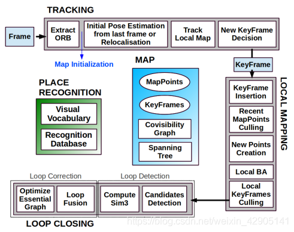
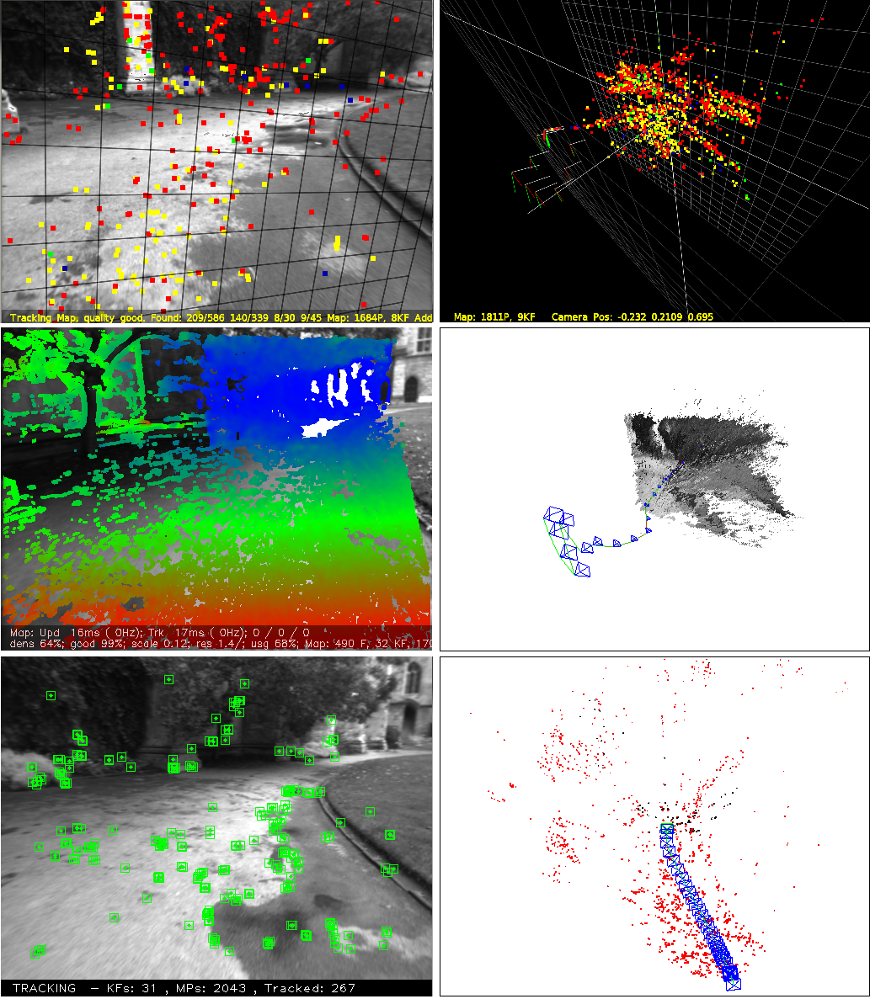

# ORB-SLAM-译

# ORB-SLAM：一种通用的精确的单目SLAM系统

<!--more-->

**摘要**：本文提出了ORB-SLAM，一种基于特征的单目SLAM系统，其可以实时操作在大小场景、室内室外环境。系统对复杂的剧烈运动具有鲁棒性，允许宽基线的闭环和重定位，且包含完整的自动初始化。基于最近几年的优秀算法之上，我们从头开始设计了一个新颖的系统，它对所有SLAM任务使用相同的特征：追踪、建图、重定位和闭环。合适的选择重建点和关键帧策略的存在使其具有很好的鲁棒性，并能够生成紧凑的可追踪的地图，并且只有当场景内容发生变化地图才改变，从而允许长时间操作。本文从最受欢迎的数据集中提供了27个序列的详尽评估。相对于其他最先进的单目SLAM方法，ORB-SLAM实现了前所未有的性能。为了社会的利益，我们将源代码公开。

**关键字**：持续建图，定位，单目视觉，识别，同时定位和制图（SLAM）。

 

## I.引言

&emsp;&emsp;BA提供相机定位的精确估计以及稀疏几何重建[1][2]，以及并且提供了强烈的匹配网络和良好的初始猜测。一段长的时间，这种方法被认为不符合实时性的应用，如视觉VSLAM。VSLAM系统在构建环境的同时需要估计相机的轨迹。现在，我们为了不以过高的计算成本获得准确的结果，实时SLAM算法必须向BA提供以下信息：

- 在候选图像帧子集中（关键帧）匹配观测的场景特征（地图云点）。

- 由于关键帧数量的增长，需要做筛选避免冗余。

- 关键帧和云点健壮的网络配置可以产生精确的结果，换言之，分布良好的关键帧集合和有明显视差、大量回环匹配的观测云点。

- 关键帧和云点位置的初始估计，采用非线性优化的方法。

- 在构建局部地图的过程中，优化的关键是获得良好的稳定性。

- 本系统可以实时执行快速全局优化（比如位姿图）以实现闭环回路。

&emsp;&emsp;BA第一次实时应用是在Mouragon等人[3]提出的视觉里程计算法中，其次是在Klein和Murray的突破性工作PTAM[4]算法中。尽管受制于小场景的应用，PTAM算法对关键帧的选择，特征匹配，点的三角化，相机位姿估计，追踪失败后的重定位非常有效。然而，由于缺少闭环检测和对遮挡场景的处理，再加上其视图不变性差，在地图初始化时需要人工干预等多个因素，使得PTAM算法的应用收到了严重的限制。

&emsp;&emsp;在本文中，我们基于PTAM算法的主要框架，采用Gálvez-López和Tardós提出的place recognition（场景/位置识别）算法，Strasdat等人提出的scale-aware loop closing（具备尺度感知的闭环检测）算法以及文献[7][8]中的大尺度操作中Covisibility信息的使用，重新设计了一种新的单目SLAM系统ORB-SLAM，本文的贡献主要包括：

 - 对所有的任务采用相同的特征：追踪、地图构建、重定位和闭环检测。这使得我们的系统更有效率、简单可靠。采用的ORB特征[9]在没有GPU的情况下也有很好的实时性，且具有旋转不变性和光照不变性。
 - 算法支持在宽阔环境中实时操作。由于covisibility graph的使用，特征点的跟踪与构图主要集中在局部共视区域，而与全局地图的大小无关。
 - 使用Essential Graph来优化位姿实现回环检测。构建生成树，并由系统、闭环检测链接和covisibility graph的强边缘进行维护。
 - 算法的实时相机重定位具有明显的旋转不变特性和光照不变性。这就使得点跟踪丢失后可以恢复，增强了地图的重用性。
 - 一种新的基于模型选择的自动鲁棒初始化过程，允许创建平面和非平面场景的初始地图。
 - 提出了一种合适的方法来选择地图点云和关键帧，通过严格删选关键帧和地图点，剔除冗余信息，使得特征点的跟踪具备了更好的稳定性，从而增强算法的可持续操作性。

 

## II.相关工作

### A.位置识别

&emsp;&emsp;Williams等人在综述[13]中比较了几种基于景象的位置识别方法，即图像到图像的匹配，这种方法在大环境下比地图到地图或图像到地图的方法更准确。在景象匹配方法中，bags of words（词袋）[14]的使用以其效率很高而脱颖而出，比如概率方法FAB-MAP[15]算法。DBoW2方法[5]则首次使用了BRIEF描述子[16]生成的二进制词袋连同非常高效的FAST特征检测算法[17]，与SURF和SIFT相比，FAST算法的运时间减小了至少一个数量级。然而，尽管系统运行效率高、鲁棒性好，采用BRIEF描述子不具有旋转不变性和尺度不变性，系统只能运行在同一平面内（否则会造成尺度变化） ，闭环检测也只能从相似的视角中进行。在我们之前的工作[11]中，我们提出了一个使用ORB特征检测子[9]的DBoW2位置识别器。ORB特征是具有旋转不变和尺度不变特性的二进制特征，因此，用它生成的快速识别器具有较好的视角不变性。我们在4组不同的数据集上演示了位置识别功能，从10K图像数据库中提取一个候选闭合回路的运算时间少于39毫秒。在本文的工作中，我们提出了一种改进版本的位置识别方法，采用covisibility信息，在检索数据库时返回几个假设情况而不是最好的匹配。

### B.地图初始化

&emsp;&emsp;单目SLAM系统需要设计专门的策略来生成初始化地图，因为单幅图像不具备深度信息。解决这个问题的一种方法是一开始跟踪一个已知结构的对象，正如文献[20]。另一个方法是用一个具有高不确定度的逆深度参数[21]来初始化点的深度信息，理想情况下，该参数会在后期逐渐收敛到真值。最近Engel提出的半稠密方法[10]中就采用类似的方法将像素的深度信息初始化为一个随机数值。

&emsp;&emsp;如果是从两个视角来初始化特征，就可以采用以下方法：一种是假设局部场景在同一平面内[4]，[22]然后利用Faugeras等人论文[23]中的单应性来重构摄像头相对位姿。另一种是将场景建模为通用情况（不一定为平面），通过Nister提出的五点算法[26]来计算本征矩阵[24][25]，但该方法存在多解的问题。这两种摄像头位姿重构方法在低视差下都没有很好的约束，如果平面场景内的所有点都靠近摄像机的中心，则结果会出现双重歧义[27]。另一方面，非平面场景可以通过线性8点算法[2]来计算基础矩阵，相机的相对位姿就可以无歧义的重构出来。

&emsp;&emsp;针对这一问题，我们在本文的第四部分提出了一个新的基于模型选择的自动初始化方法，即对平面场景算法选择单应性矩阵，而对于非平面场景，算法选择基础矩阵。模型选择的综述方法参见Torr等人的论文[28]。基于类似的理论，我们设计了一种启发式初始化算法，算法考虑到在接近退化情况（比如：平面，近平面，或是低视差）下选择基础矩阵进行位姿估计可能存在的问题，则选择单应性计算。在平面的情况下，为了保险起见，如果最终存在双重歧义，则算法避免进行初始化，因为可能会因为错误选择而导致算法崩溃。因此，我们会延迟初始化过程，直到所选的模型在明显的视差下产生唯一的解。

### C.单目SLAM

&emsp;&emsp;单目SLAM最初采用滤波框架[20][21][29][30]来建模。在该类方法中，每一帧都通过滤波器联合估计地图特征位置和相机位姿。这样做带来的问题是在处理连续帧图像上对计算资源的浪费和线性误差的累积。而另外一种SLAM框架是基于关键帧的[3][4]，即采用少数筛选过的图像（关键帧）来构建地图，因为构图不再与帧率相关联，因此基于关键帧的SLAM方法不但节省了计算资源，还可以进行高精度的BA优化。Strasdar等人在论文[31]中证明了基于关键帧的单目SLAM方法比滤波器方法在相同的运算代价上定位结果更精确。

&emsp;&emsp;基于关键帧的SLAM系统最具代表性可能是由Klein和Murray等人提出的PTAM算法[4]。它第一次将相机追踪和地图构建拆分成两个并行的线程运行，并成功用于小环境的实时增强现实中。后来文献[32]引入边缘特征对PTAM算法进行了改进，在跟踪过程中增加了旋转估计步骤，实现了更好的重定位效果。由于PTAM中的地图云点通过图像区块与FAST角点匹配，因此仅适合于特征跟踪并不适合用于后期的位置识别。而实际上，PTAM算法并没有进行大闭环检测，其重定位也仅是基于关键帧低分辨率缩略图的相关性进行的，因此视角不变性较差。

&emsp;&emsp;Strasdat等人在文献[6]中提出了一个基于GPU实现的大尺度单目SLAM系统，其前端采用光流算法，其次用FAST特征匹配和运动BA，以及后端是基于滑动窗口BA。闭环检测通过具有相似性约束（7自由度）的位姿图优化来完成，该方法可以矫正在单目SLAM系统中出现的尺度偏移问题。在本文中，我们也将采用这种7自由度的位姿图优化方法，并将其应用到我们的Essential Graph中，更多细节将在第三部分D节里面描述。

&emsp;&emsp;Strasdat等人在文献[7]中采用了PTAM的前端，但其跟踪部分仅在一个从covisibility graph提取的局部图中进行。他们提出了一个双窗口优化后端，在内部窗口中连续进行BA，在有限大小的外部窗口中构建位姿图。然而， 只有当外部窗口尺寸足够大到可以包含整个闭环回路的情况下，闭环检测才能起作用。在我们的算法中，我们利用了Strasdat等人提出的基于covisibility的局部地图的优势，并且通过covisibility map来构建位姿图，同时重新设计前端和后端。另一个区别是，我们并没有用特别的特征提取方法做闭合回路检测（比如SURF方法），而是基于相同的追踪和建图的特征进行位置识别，获得具有鲁棒性的重定位和闭环检测。

&emsp;&emsp;在Pirker等人的论文[33]中作者提出了CD-SLAM方法，一个非常复杂的系统，包括闭环检测，重定位，大尺度操作以及对算法在动态环境运行所做的改进。但文中并没有提及地图初始化。因此不利于后期读者对算法的复现，也致使我们没法对其进行精确性、鲁棒性和大场景下的测试对比。

&emsp;&emsp;Song等人在论文[34]提出的视觉里程计方法中使用了ORB特征做追踪和处理BA后端滑动窗口。相比之下，我们的方法更加全面，因为他们的算法中没有涉及全局重定位，闭环回路检测，而且地图也不能重用。他们也使用了相机到地面的真实距离来限制单目SLAM算法的尺度漂移。

&emsp;&emsp;Lim等人在我们提交本文最初的版本[12]之后发表了论文[25]，他们也采用相同的特征进行跟踪，地图构建和闭环检测。但是，由于Lim等人的算法选择的BRIEF描述子不具备尺度不变性，因此其算法运行受限在平面轨迹上。并且他们的算法仅从上一帧关键帧开始跟踪特征点，因此访问过的地图不能重用，这样的处理方式与视觉里程计很像，存在系统无限增长的问题。我们在第三部分E小节里面与该算法进行了定性比较。

&emsp;&emsp;Engel等人在最近的论文[10]里提出了LSD-SLAM算法，其没有采用特征提取和BA方法，而是选择采用直接法（优化也是直接通过图像像素灰度进行）构建了大场景的半稠密地图。算法的结果让人印象深刻，其在没有GPU加速的情况下实时构建了一个半稠密地图，相比基于特征的稀疏地图SLAM系统而言，LSD-SLAM方法在机器人领域有更大的应用潜力。然而，该算法的运行仍然需要基于特征做闭环检测，且相机定位的精度也明显低于PTAM和我们的算法，相关实验结果我们将在第8部分的B小节中展示，对该结果的讨论在文章IX部分B小节进行。

&emsp;&emsp;Forster等人在论文[22]中提出了介于直接方式和基于特征的方法之间的半直接视觉里程计算法SVO方法。该方法不需要对每帧图像都提取特征点，且可以以很高的帧率运行，在四轴飞行器上取得了令人惊叹的定位效果。然而，SVO算法没有进行闭环检测，且目前主要基于下视摄像头运行。

&emsp;&emsp;最后，我们想讨论一下目前关键帧的选择方法。由于所有的视觉SLAM算法选择所有的云点和图像帧运行BA是不可行的。因此，在论文[31]中，Strasdat等人证明最合理的选择是保留尽可能多地点云和非冗余关键帧。PTAM方法非常谨慎插入关键帧避免运算量增长过大。然而，这种严格限制关键帧插入的策略在算法运行困难的情况下可能会导致追踪失败。在本文中，为了达到更好的稳定性，我们选择一种更为合适的关键帧插入策略，当算法运行困难的时候算法选择尽快的插入关键帧，然后在后期将冗余的关键帧删除以避免额外的计算成本。

 

## III.系统架构

### A.特征选择

&emsp;&emsp;我们系统设计的中心思想是对SLAM系统的构图、跟踪、重定位以及闭环检测等模块都采用相同的特征。这将使得我们的系统更有效率，避免了像以往文章[6][7]一样还需要额外插入一些额外的识别性强的特征以用于后期的闭环检测。我们每张图像的特征提取远少于33毫秒，远小于目前的SIFT算法（300ms）,SURF算法(300ms)，或最近提出的A-KAZE（~100ms）算法。为了使算法的位置识别能力能更加通用化，我们需要提取的特征具备旋转不变性，而BRIEF和LDB不具备这样的特性。

&emsp;&emsp;我们选择了我们选择了ORB[9]，其是具有256位描述符的带方向的多尺度FAST角点。他们对于计算和匹配的速度非常快，同时对视角具有旋转不变的特性。这样可以在更宽的基准线上匹配他们，增强了BA的精度。我们已经在论文[11]sup中演示了基于ORB特征的位置识别性能。需要申明的是，虽然本文的方案中采用ORB算法，但所提出的技术并不仅限于该特征。

### B.三个线程：跟踪，局部地图构建以及回环检测

    
     
    
图1.ORB-SLAM系统框架，图中显示了算法的三个线程——跟踪、局部构图与闭环检测的所有步骤。另外还有场景识别和地图的主要组成部分。

&emsp;&emsp;我们的系统，如图1所示，包含三个并行的线程：跟踪，局部地图构建以及回环检测。跟踪线程负责对每帧图像的相机位置进行定位，并决定什么时候插入新的关键帧。我们首先通过与前一帧图像匹配得到初始特征点，然后采用运动BA优化摄像头位姿。如果特征跟丢（比如由于遮挡或是突然运动），则由位置识别模块进行全局重定位。一旦获得最初的相机位姿估计和特征匹配，则使用由系统维护的关键帧的`covisibility graph`提取一个局部可视化地图，如图2(a)、图2(b)所示。然后通过重投影方法搜索当前帧与局部地图点对应的匹配点，并利用所有的匹配点优化当前相机位姿。最后，跟踪线程决定是否插入新的关键帧。所有的跟踪步骤将在第5部分详细阐述。创建初始化地图的新方法将在第4部分进行说明。

 

## IV.地图自动初始化

&emsp;&emsp;地图初始化的目的是计算两帧图像之间的相对位姿来三角化一组初始的地图云点。这个方法应该与场景无关（平面的一般平面），而且不需要人工干预去选择良好的双视图配置，比如两幅图应具有明显的视差。本文算法提出并行计算两个几何模型，一个是面向平面视图的单映矩阵，另一个是面向非平面视图的基础矩阵。然后，采用启发式的方法选择模型，并使用所选的模型从两图像的相对位姿中对地图点云进行重构。本文算法只有当两个视图之间的视差达到安全阈值时，才进行地图初始化。如果检测到低视差的情况或已知两视图模糊的情况（如论文[27]所示），则为了避免生成一个有缺陷的地图而推迟初始化。算法的步骤是：

&emsp;1）查找初始的匹配点对：

&emsp;&emsp;从当前帧中提取ORB特征$F_c$（只在最好的尺度上），与在参考帧$F_r$搜索匹配点对$x_c$↔$x_r$。如果找不到足够的匹配点对，就重置参考帧。

&emsp;2）并行计算两个模型：

&emsp;&emsp;在两个线程上并行计算单应矩阵$H_{cr}$和基础矩阵$F_{cr}$：
$$
x_c=H_{cr}x_r{\quad}{\quad}{\quad}{\quad}x_c^TF_{cr}x_r=0 \tag {1}
$$
&emsp;&emsp;在文献[2]中详细解释了基于RANSAC的归一化DLT算法和8点算法计算原理。为了使两个模型的计算流程尽量一样，将两个模型的迭代循环次数预先设置成一样，每次迭代的特征点数目也预先设置好，基础矩阵是8个特征点对，单映矩阵是4个特征点对。每次迭代中，我们给每个模型M（H表示单映射，F表示基本矩阵）计算一个分值SM：
$$
S_{M}=\sum_{i}\left(\rho_{M}\left(d_{c r}^{2}\left(\mathbf{x}_{c}^{i}, \mathbf{x}_{r}^{i}, M\right)\right)+\rho_{M}\left(d_{r c}^{2}\left(\mathbf{x}_{c}^{i}, \mathbf{x}_{r}^{i}, M\right)\right)\right) \newline
\rho_{M}\left(d^{2}\right)=\begin{cases}
\Gamma-d^{2} & \text { if } & d^{2}<T_{M} \newline
0 & \text { if } & d^{2} \geq T_{M}
\end{cases}  \tag {2}
$$
&emsp;&emsp;其中，$d_{cr}^2$和$d_{rc}^2$是帧到帧之间的对称传递误差[2]。$T_M$是无效数据的排除阈值，它的依据是$\chi^2$测试的95%（$T_H$=5.99，$T_F$=3.84，假设在测量误差上有1个像素的标准偏差）。$\Gamma$等于$T_H$，这样两个模型在有效数据上对于同一误差$d$的分值相同，使得运算流程一致。

&emsp;&emsp;我们从单应矩阵和基本矩阵的计算中选择分值最高的，但如果两个模型分值都不高（没有足够的局内点），则算法流程重启，从step1开始重新计算。

&emsp;3）模型选择：

&emsp;&emsp;如果场景是平面，近平面或存在低视差的情况，则可以通过单映矩阵来求解。同样地，我们也可以找到一个基础矩阵，但问题是基础矩阵不能够很好的约束该问题[2]，而且从基础矩阵中计算得到的运动结果是错误的。在这种情况下，我们应该选择单映矩阵才能保证地图初始的正确性，或者如果检测到低视差的情况则不进行初始化工作。另一方面，对于非平面场景且有足够的视差的情况则可以通过基础矩阵来计算，而在这种情况下单映矩阵只有基于平面点或者低视差的匹配点才能找到。因此，在这种情况下我们应该选择基础矩阵。我们利用如下强大的启发式进行计算：
$$
R_{H}=\frac{S_{H}}{S_{H}+S_{F}} \tag{3}
$$
&emsp;&emsp;如果$R_H$>0.45，这表示二维平面和低视差的情况，我们将选择计算单应矩阵。其他的情况，我们选择基础矩阵。
&emsp;4）运动和从运动到结构的重构：

&emsp;&emsp;一旦选好模型，我们就可以获得相应的运动状态。如果是单应矩阵，我们按照Faugeras等人发表的论文[23]中提到的方法得到8种运动假设。该方法提出用cheriality测试来选择有效解。然而，如果在低视差的情况下，这些测试就会失效，因为云点很容易在相机的前面或后面移动，会导致选解错误。我们提出直接根据这8种解来进行三角化，然后检查是否有一种解可以使得所有的云点都位于两个相机的前面，且重投影误差较小。如果没有一个明确的解胜出，我们就不执行初始化，重新从第一步开始。这种方法使初始化程序在低视差和两个交叉的视图情况下更具鲁棒性，这也是我们整个算法体现鲁棒性的关键所在。

&emsp;&emsp;如果是基本矩阵，我们使用标定矩阵$K$来将其转换为本质矩阵：
$$
E_{r c}={K}^{T} {F}_{r c} {K} \tag {4}
$$
&emsp;&emsp;然后通过文献[4]中的奇异值分解得到4个运动解。和上文一样，通过三角化特征点，来选择一个正解。

&emsp;5）Bundle adjustment：

&emsp;&emsp;最后我们执行一个全局BA，详细优化过程参见附录，以优化初始重构得到的点云地图。

&emsp;&emsp;如图3所示是对论文[39]中的室外NewCollege机器人图像序列进行地图初始化的例子，室外环境下初始化工作具有很大挑战性。从图中可以看出，PTAM算法和LSD-SLAM算法对位于同一平面上的所有点都进行了初始化，而我们的方法是当两幅图像有足够视差之后才进行初始化，并基于基础矩阵得到了正确的结果。

    
     
    
图3.基于NewCollege图像序列[39]进行地图初始化，最上面一行：PTAM算法,中间一行：LSD-SLAM算法，底下一行：ORB-SLAM算法。其中，PTAM算法和LSD-SLAM算法初始化了一个错误的平面地图，而我们的方法自动选择在两帧图像存在足够视差的情况下再利用基础矩阵初始化。如果人工选择关键帧，则PTAM算法也能够初始化得很好

 

## V.跟踪

&emsp;&emsp;在这一部分，我们将详细介绍跟踪线程在相机每帧图像上执行的步骤。在几个步骤中都提到的相机位姿优化，包括运动BA，将在附录部分进行阐述。

### A.ORB特征提取

&emsp;&emsp;我们在8层图像金字塔上提取FAST角点，金字塔图像尺度因子为1.2。如果图像的分辨率从512\*384到752\*480，我们发现提取1000个角点比较合适，如果分辨率提高，如KITTI数据集[40]，则提取2000个角点。为了确保特征点均匀分布，我们将每层图像分成网格，每格提取至少5个角点。然后检测每格角点，如果角点数量不够，就调整阈值。如果某些单元格内没有角点，则其对应提取的角点数量也相应减少。最后，根据保留的FAST的角点计算方向和ORB特征描述子。ORB特征描述子将用于算法后续所有的特征匹配，而不是像PTAM算法中那样根据图像区块的相关性进行搜索。

### B.通过前一帧估计初始位姿

&emsp;&emsp;如果上一帧图像跟踪成功，我们就用运动速率恒定模型来预测当前相机的位置，然后搜索上一帧图像中的特征点在地图中的对应云点与当前帧图像的匹配点，最后利用搜索到的匹配点对当前相机的位姿进一步优化。但是，如果没有找到足够的匹配点（比如，运动模型失效，非匀速运动），我们就加大搜索范围，搜索地图云点附近的点在当前帧图像中是否有匹配点，然后通过寻找到的对应匹配点对来优化当前时刻的相机位姿。

### C.通过全局重定位开初始化位姿

&emsp;&emsp;如果扩大了搜索范围还是跟踪不到特征点，（那么运动模型已经失效），则计算当前帧图像的词袋（BoW）向量,并利用BoW词典选取若干关键帧作为备选匹配帧（这样可以加快匹配速度）。然后我们计算每个备选关键帧与地图云点相对应的ORB特征，如第三部分E节所描述。接着，对每个备选关键帧轮流执行PnP算法[41]计算当前帧的位姿（RANSAC迭代求解）。如果我们找到一个姿态能涵盖足够多的有效点，则搜索该关键帧对应的更多匹配云点。最后，基于找到的所有匹配点对相机位置进一步优化，如果有效数据足够多，则跟踪程序将持续执行。

### D.跟踪局部地图

&emsp;&emsp;一旦我们获得了相机的初始位姿估计以及一组初始特征匹配点，我们就可以将更多地地图云点投影到图像上以寻找更多的匹配点。为了降低大地图的复杂性，我们只映射局部地图。该局部地图包含一组关键帧$K_1 $,它们和当前关键帧有共同的地图云点，还包括与关键帧$K_1$在`covisibility graph`中相邻的一组关键帧$K_2$。这个局部地图中有一个参考关键帧$K_{\mathrm{ref}} \in {K}_{1}$，它与当前帧具有最多共同的地图云点。现在对K1, K2中可见的每个地图云点，在当前帧中进行如下搜索：

&emsp;1）计算地图点云在当前帧图像中的投影$\mathrm{x}$，如果投影位置超出图像边缘，就将删去对应点云。

&emsp;2）计算当前视图射线$v$和地图云点平均视图方向$\mathbf{n}$的夹角。如果$\mathbf{v} \cdot \mathbf{n}<\cos \left(60^{\circ}\right)$，就删去对应点云。

&emsp;3）计算地图点云到相机中心的距离$\mathrm {d}$，如果它不在地图点云的尺度不变区间内，即$d \notin\left[d_{\min }, d_{\max }\right]$，就删去该电云。

&emsp;4）计算每帧图像的尺度比$d / d_{\min }$。

&emsp;5）对比地图云点的特征描述子$D$和当前帧中还未匹配的ORB特征，在预测的尺度层和靠近$\mathrm{x}$的云点作最优匹配。

&emsp;&emsp;相机位姿最后通过当前帧中获得所有的地图云点进行优化。

### E.新关键帧的判断

&emsp;&emsp;最后一步是决定当前帧是否可以作为关键帧。由于局部地图构建的过程中有一个机制去筛选冗余的关键帧，所以我们需要尽快地插入新的关键帧以保证跟踪线程对相机的运动更具鲁棒性，尤其是对旋转运动。我们根据以下要求插入新的关键帧：

&emsp;1）距离上一次全局重定位后需要超过20帧图像。

&emsp;2）局部地图构建处于空闲状态，或距上一个关键帧插入后，已经有超过20帧图像。

&emsp;3）当前帧跟踪少于50个地图云点。

&emsp;4）当前帧跟踪少于参考关键帧$K_{ref}$云点的90%。

&emsp;&emsp;与PTAM中用关键帧之间的距离作为判断标准不同，我们加入一个最小的视图变换，如条件4。条件1 确保一个好的重定位，条件3保证好的跟踪。如果局部地图构建处于忙状态（条件2的后半部分）的时候插入关键帧，就会发信号去暂停局部BA，这样就可以尽可能快地去处理新的关键帧。

